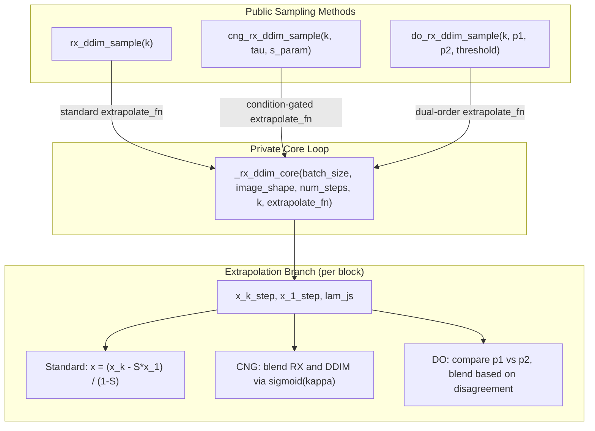

# Adaptive RX-DDIM Sampling Methods

## Architecture

Both methods share ~90% of the `rx_ddim_sample` loop (timestep scheduling, k-step fine path, 1-step coarse path, gamma-space lambda computation). They differ only in the final extrapolation branch (line 452 of [src/methods/ddpm.py](src/methods/ddpm.py)). We will factor the shared loop into a private helper that accepts a pluggable extrapolation function.




## File Changes

### 1. [src/methods/ddpm.py](src/methods/ddpm.py) — Core implementation

**A. Extract `_rx_ddim_core` private method** (refactor lines 376-458)

Move everything from `rx_ddim_sample` into a private `_rx_ddim_core(self, batch_size, image_shape, num_steps, k, extrapolate_fn)` method. The `extrapolate_fn` signature will be:

```python
def extrapolate_fn(x_k_step: Tensor, x_1_step: Tensor, lam_js: List[float]) -> Tensor
```

Where `lam_js` is the list of per-sub-step lambda values in gamma-space (currently computed in the loop at lines 446-450). Each public method constructs its own closure and passes it in.

The core method replaces the current line 452 with:

```python
x = extrapolate_fn(x_k_step, x_1_step, lam_js)
```

**B. Rewrite `rx_ddim_sample` as a thin wrapper** calling `_rx_ddim_core` with:

```python
def _standard_extrapolate(x_k_step, x_1_step, lam_js):
    p = 2
    S = sum(lj ** p for lj in lam_js)
    return (x_k_step - S * x_1_step) / (1.0 - S)
```

Verify this produces identical output to the current implementation.

**C. Add `cng_rx_ddim_sample**` — Condition-Number-Gated method

New parameters: `tau: float = 0.3`, `s_param: float = 0.1`

Extrapolation function:

```python
def _cng_extrapolate(x_k_step, x_1_step, lam_js):
    p = 2
    S = sum(lj ** p for lj in lam_js)
    kappa = abs(1.0 - S)
    alpha = torch.sigmoid(torch.tensor((kappa - tau) / s_param))
    x_rx = (x_k_step - S * x_1_step) / (1.0 - S)
    return alpha * x_rx + (1.0 - alpha) * x_k_step
```

When `|1 - S|` is large (many steps, well-conditioned), `alpha -> 1` and we get full RX-DPM. When `|1 - S|` approaches zero (few steps, ill-conditioned), `alpha -> 0` and we recover plain DDIM (i.e., `x_k_step`).

**D. Add `do_rx_ddim_sample**` — Dual-Order Error Estimation method

New parameters: `p1: int = 2`, `p2: int = 3`, `do_threshold: float = 0.1`

Extrapolation function:

```python
def _do_extrapolate(x_k_step, x_1_step, lam_js):
    S1 = sum(lj ** p1 for lj in lam_js)
    S2 = sum(lj ** p2 for lj in lam_js)
    x_rx1 = (x_k_step - S1 * x_1_step) / (1.0 - S1)
    x_rx2 = (x_k_step - S2 * x_1_step) / (1.0 - S2)
    disagreement = torch.norm(x_rx1 - x_rx2) / (torch.norm(x_k_step) + 1e-8)
    alpha = torch.sigmoid(torch.tensor((1.0 / (disagreement + 1e-8) - 1.0 / do_threshold) * do_threshold))
    return alpha * x_rx1 + (1.0 - alpha) * x_k_step
```

When the two orders agree (polynomial assumption holds), `disagreement` is small, `alpha -> 1`, and we trust the lower-order extrapolation. When they disagree (assumption violated), `alpha -> 0`, and we fall back to the stable DDIM result.

### 2. [sample.py](sample.py) — CLI routing

- **Line 88**: Add `'cng_rx_ddim'` and `'do_rx_ddim'` to `--method` choices
- **Lines 106-107**: Add new CLI arguments:
  - `--tau` (float, default 0.3) for CNG method
  - `--s_param` (float, default 0.1) for CNG method  
  - `--p1` (int, default 2) and `--p2` (int, default 3) for DO method
  - `--do_threshold` (float, default 0.1) for DO method
- **Line 132**: Add `'cng_rx_ddim'` and `'do_rx_ddim'` to the `in ('ddpm', 'ddim', 'rx_ddim')` tuple so they create a DDPM method instance
- **Lines 177-183**: Add `elif` branches for the two new methods, calling `method.cng_rx_ddim_sample(...)` and `method.do_rx_ddim_sample(...)` respectively, passing through the relevant args

### 3. [evaluate_rx_ddim.py](evaluate_rx_ddim.py) — Benchmark support

- **Line 229**: Add `'cng_rx_ddim'` and `'do_rx_ddim'` to `--method` choices
- Add `--tau`, `--s_param`, `--p1`, `--p2`, `--do_threshold` CLI args
- **Lines 92-101**: Add `elif` branches in `run_kid_mode` to call the new sample methods
- **Lines 166-175**: Add the new methods to the L2 sweep loop in `run_l2_mode`

## Default Hyperparameter Rationale

- **tau=0.3, s_param=0.1** (CNG): At high NFE, `|1-S|` is typically 0.5-0.8 (well above tau), giving alpha near 1.0. At 3 steps with k=2, `|1-S|` drops toward 0.1-0.2, placing it right in the sigmoid transition zone. The sharpness s=0.1 gives a transition width of about 0.2 in kappa-space.
- **p1=2, p2=3** (DO): p=2 matches DDIM's first-order Euler structure. p=3 tests whether the error has a cubic component. If they agree, the quadratic model is reliable.
- **do_threshold=0.1** (DO): 10% relative disagreement between the two orders signals the polynomial assumption is breaking down.

These are starting points; the test sweep will validate or adjust them.