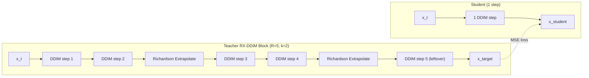

# RX-DDIM Progressive Distillation v2

## What Changes and Why

The original distillation used a plain DDIM teacher with 5 stages (50->25->12->6->3->1) and hit NaN at Stage 2 iter 15K. This rewrite:

1. **RX-DDIM teacher** -- higher quality targets via Richardson extrapolation (k=2)
2. **3 aggressive stages** -- 50->10->5->1 (fewer stages = less error propagation)
3. **NaN safeguards** -- detect and skip NaN/Inf gradient updates, abort after consecutive failures
4. **Dense checkpoints** -- every 200 iterations for ALL stages (for LCSC)
5. **5->2->1 fallback** -- included as stages 4-5 in config, only used if stage 3 fails

## File Changes

### 1. Rewrite [train_distill.py](train_distill.py)

**Replace the teacher functions** (`teacher_two_step_ddim`, `teacher_one_step_ddim`) with a single `teacher_rx_ddim_block` that runs RX-DDIM over an arbitrary sub-schedule:

```python
@torch.no_grad()
def teacher_rx_ddim_block(teacher, x_t, sub_schedule, alphas_cumprod, gammas, k=2):
    """Run RX-DDIM with extrapolation interval k over a sub-schedule.
    
    sub_schedule: 1D LongTensor of R+1 timestep indices (e.g. [900, 720, 540, 360, 180, 0])
    Returns x at the end of the sub-schedule.
    """
```

This mirrors `_rx_ddim_core`'s inner loop (lines 398-459 of `ddpm.py`) but operates on an explicit model and sub-schedule, with standard extrapolation (S = sum(lam_j^2)).

**Generalize block structure in `train_one_stage`:**

The current code assumes 2:1 compression (pairs). The new code computes the compression ratio `R = teacher_steps // student_steps` and groups the teacher's schedule into blocks of R steps. Each iteration:

- Pick a random block index (0 to student_steps-1)
- Extract sub-schedule: `teacher_schedule[block_idx*R : block_idx*R + R + 1]`
- Teacher: run `teacher_rx_ddim_block(teacher, x_t, sub_schedule, ...)`
- Student: run 1 DDIM step from `sub_schedule[0]` to `sub_schedule[-1]`
- Loss = MSE(x_student, x_target)

Handle remainder blocks when `teacher_steps % student_steps != 0` (e.g., 5->2 has R=2 with 1 leftover) by making the last block absorb the extra step.

**Add NaN safeguards to the training loop:**

```python
loss_val = loss.item()
if not math.isfinite(loss_val):
    nan_count += 1
    print(f"  WARNING: NaN/Inf loss at step {step+1} (count={nan_count})")
    optimizer.zero_grad()
    if nan_count >= max_nan_consecutive:
        print(f"  ABORTING: {max_nan_consecutive} consecutive NaN steps")
        break
    continue
nan_count = 0  # reset on valid loss
```

Place this check AFTER `loss = F.mse_loss(...)` but BEFORE `scaler.scale(loss).backward()`. Set `max_nan_consecutive = 50` (configurable).

**Change checkpoint saving to every 200 iterations for ALL stages** (not just final). Replace the `save_every` / `is_final_stage` logic with a flat `save_every = distill_cfg.get("save_every", 200)`.

**Update progress bar description** to show actual compression ratio, e.g. `Stage 1 (50->10 RX-DDIM)`.

### 2. Update [configs/pd_distill.yaml](configs/pd_distill.yaml)

Replace the 5-stage DDIM plan with:

```yaml
distillation:
  teacher_checkpoint: "logs/ddpm_modal/ddpm_20260127_162352/checkpoints/ddpm_final.pt"
  teacher_type: "rx_ddim"   # use RX-DDIM teacher (vs "ddim")
  rx_k: 2                   # extrapolation interval for RX-DDIM teacher
  save_every: 200           # checkpoint every 200 iters for ALL stages
  max_nan_consecutive: 50   # abort stage after this many consecutive NaN steps

  stages:
    # Primary plan: 3 stages
    - { teacher_steps: 50, student_steps: 10 }
    - { teacher_steps: 10, student_steps:  5 }
    - { teacher_steps:  5, student_steps:  1 }
    # Fallback (use --resume_stage 3 if stage 3 fails):
    # - { teacher_steps:  5, student_steps:  2 }
    # - { teacher_steps:  2, student_steps:  1 }
```

Keep all other sections (model, training, ddpm, infrastructure) identical.

### 3. No changes to sampling code

`dws_rx_ddim_sample` in [src/methods/ddpm.py](src/methods/ddpm.py), [sample.py](sample.py), and [modal_app.py](modal_app.py) are already correct -- the distilled checkpoint has the same interface regardless of whether the teacher was DDIM or RX-DDIM.

## Architecture: Teacher Block Computation



## Checkpoint Output

- All stages save every 200 iterations
- Stage 1: 50K/200 = 250 checkpoints
- Stage 2: 250 checkpoints
- Stage 3: 250 checkpoints
- Total: 750 checkpoints + 3 finals = 753 files
- Naming: `pd_stage{s}_step{step:07d}.pt` and `pd_stage{s}_final.pt`

## Fallback Plan

If Stage 3 (5->1) goes NaN, uncomment the fallback stages in the YAML and run:

```bash
modal run modal_app.py --action distill --config configs/pd_distill.yaml
```

with `--resume_stage 3` pointing to the 5->2 stage, using the stage 2 final checkpoint as teacher.
