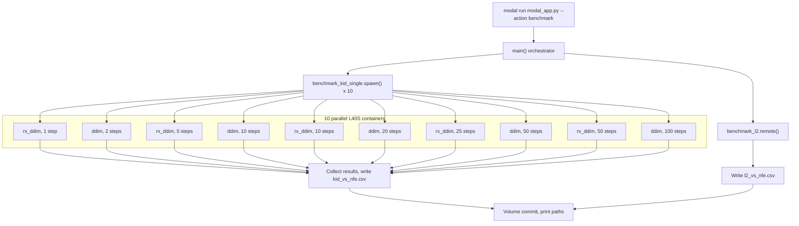

# RX-DDIM Benchmark Script Plan

## Overview

Create `evaluate_rx_ddim.py` with two modes, and wire it into [modal_app.py](modal_app.py) so that KID evaluation is parallelized across 10 independent L40S containers (one per method+step_count config) while L2 error runs on a single GPU with 8 samples. All results are written to CSV on the shared Modal volume.

## Architecture




## Step Counts

- **RX-DDIM:** [1, 5, 10, 25, 50] steps
- **DDIM:** [2, 10, 20, 50, 100] steps (always 2x the corresponding RX-DDIM value)
- **10 total configs** (5 pairs)

## Estimated Runtime (parallel on up to 10x L40S)

Reference: 5000 samples at 1000 steps, bs=32 = 2.5 hours (150 min) sequential.


| Phase                  | Detail                                                   | Wall-clock     |
| ---------------------- | -------------------------------------------------------- | -------------- |
| L2 (single GPU)        | 8 samples x 1000-step ground truth + 10 low-step configs | ~2 min         |
| KID gen (parallel)     | Bounded by slowest: ddim 100 steps x 5000 samples        | ~5 min         |
| KID compute (parallel) | torch-fidelity per container                             | ~3 min         |
| Overhead               | Model loading per container, dataset check               | ~2 min         |
| Aggregation            | Collect 10 results, write CSV                            | seconds        |
| **Total**              |                                                          | **~10-12 min** |


## File 1: `evaluate_rx_ddim.py` (new script)

A standalone CLI script with two modes, callable locally or via subprocess from Modal.

### Mode 1: `--mode kid` (single config, run by each parallel worker)

Generates samples for ONE (method, step_count) config, runs torch-fidelity KID, and prints the result as a parseable output line.

```
python evaluate_rx_ddim.py --mode kid \
    --checkpoint PATH \
    --method ddim \
    --num_steps 20 \
    --k 2 \
    --num_samples 5000 \
    --batch_size 32 \
    --output_dir /data/benchmark/ddim_20 \
    --dataset_path /data/celeba_images
```

Steps:

1. Load checkpoint, apply EMA
2. Generate `num_samples` images using the specified method and step count, save to `output_dir/`
3. Run `fidelity --kid --input1 output_dir --input2 dataset_path`, parse KID mean/std
4. Print result line: `ddim,20,20,0.0180,0.0012`

Each parallel worker writes to its own unique directory (`/data/benchmark/ddim_20/`, `/data/benchmark/rx_ddim_10/`, etc.) so there are no file collisions.

### Mode 2: `--mode l2` (all configs, single GPU, in-memory)

Runs the full L2 error sweep on a single GPU. Uses 8 samples with shared initial noise.

```
python evaluate_rx_ddim.py --mode l2 \
    --checkpoint PATH \
    --rx_step_counts 1,5,10,25,50 \
    --num_samples_l2 8 \
    --k 2 \
    --seed 42 \
    --output_csv /data/benchmark/l2_vs_nfe.csv
```

Steps:

1. Load checkpoint, apply EMA
2. Fix seed, generate `x_T` for 8 images
3. Run DDIM at 1000 steps from `x_T` to produce ground truth
4. For each N in [1, 5, 10, 25, 50]:
  - Reset seed, run RX-DDIM at N steps from same `x_T`
  - Reset seed, run DDIM at 2N steps from same `x_T`
  - Compute `||x_approx - x_gt||_2 / ||x_gt||_2` and MSE per sample
  - Record mean and std
5. Write `l2_vs_nfe.csv`

**Key implementation details:**

- Checkpoint loading: reuse pattern from [sample.py](sample.py) lines 41-54
- Model creation: `DDPM.from_config(model, config, device)`
- Sampling: `method.ddim_sample(...)` and `method.rx_ddim_sample(...)`
- Image saving (KID mode): reuse `save_samples` from [sample.py](sample.py) lines 57-76
- KID computation: `fidelity` CLI via subprocess, same as [modal_app.py](modal_app.py) lines 420-434
- L2 mode uses `torch.manual_seed(seed)` before each sample call so that `torch.randn` in `ddim_sample`/`rx_ddim_sample` draws the same `x_T`

## File 2: `modal_app.py` (modifications)

### Change A -- Thread `--k` through existing paths

- `sample()` function (line 204): Add `k: int = None` param. Pass `["--k", str(k)]` to cmd when not None.
- `evaluate_torch_fidelity()` (line 293): Add `k: int = None` param. Pass `["--k", str(k)]` to sample_cmd when not None.
- `main()` entrypoint (line 459): Add `k: int = None` param. Pass through to `.remote()` calls.

### Change B -- Add parallel benchmark functions

`**benchmark_kid_single**` -- Worker function, one per config:

```python
@app.function(image=image, gpu="L40S", timeout=60*60*2, volumes={"/data": volume})
def benchmark_kid_single(
    method: str,          # "ddim" or "rx_ddim"
    num_steps: int,
    checkpoint: str,
    num_samples: int = 5000,
    batch_size: int = 32,
    k: int = 2,
) -> str:
    # Ensure dataset images exist (same logic as evaluate_torch_fidelity)
    # Call: python evaluate_rx_ddim.py --mode kid ...
    # Output dir: /data/benchmark/{method}_{num_steps}/
    # Parse and return result line: "method,num_steps,nfe,kid_mean,kid_std"
    # volume.commit()
```

`**benchmark_l2**` -- Single-GPU L2 evaluation:

```python
@app.function(image=image, gpu="L40S", timeout=60*60, volumes={"/data": volume})
def benchmark_l2(
    checkpoint: str,
    num_samples_l2: int = 8,
    k: int = 2,
    seed: int = 42,
) -> str:
    # Call: python evaluate_rx_ddim.py --mode l2 ...
    # Output: /data/benchmark/l2_vs_nfe.csv
    # volume.commit()
    # Return path to CSV
```

`**main()` orchestrator** -- `action == "benchmark"` branch:

```python
elif action == "benchmark":
    # 1. Launch L2 evaluation
    l2_handle = benchmark_l2.spawn(checkpoint=checkpoint, ...)

    # 2. Launch 10 KID workers in parallel
    configs = [
        ("rx_ddim", 1), ("ddim", 2),
        ("rx_ddim", 5), ("ddim", 10),
        ("rx_ddim", 10), ("ddim", 20),
        ("rx_ddim", 25), ("ddim", 50),
        ("rx_ddim", 50), ("ddim", 100),
    ]
    kid_handles = []
    for method_name, steps in configs:
        h = benchmark_kid_single.spawn(
            method=method_name, num_steps=steps,
            checkpoint=checkpoint, num_samples=num_samples, ...
        )
        kid_handles.append(h)

    # 3. Collect KID results, write kid_vs_nfe.csv
    kid_results = [h.get() for h in kid_handles]
    # Write CSV locally then upload, or write via a small final function

    # 4. Wait for L2
    l2_path = l2_handle.get()
    print(f"KID results: /data/benchmark/kid_vs_nfe.csv")
    print(f"L2 results: {l2_path}")
```

No file collisions: each KID worker writes to `/data/benchmark/{method}_{num_steps}/` (unique per config). The orchestrator in `main()` runs locally and just collects return strings.

### Usage on Modal

```bash
# Full benchmark (~10-12 min wall-clock, 10 parallel L40S + 1 for L2)
modal run modal_app.py --action benchmark \
    --checkpoint checkpoints/ddpm_modal/ddpm_final.pt \
    --num-samples 5000

# Download results
modal volume get cmu-10799-diffusion-data benchmark/kid_vs_nfe.csv .
modal volume get cmu-10799-diffusion-data benchmark/l2_vs_nfe.csv .
```

## Output CSV Formats

`**kid_vs_nfe.csv`:**

```
method,num_steps,nfe,kid_mean,kid_std
rx_ddim,1,1,0.1200,0.0045
ddim,2,2,0.0950,0.0038
rx_ddim,5,5,0.0623,0.0028
ddim,10,10,0.0341,0.0019
rx_ddim,10,10,0.0290,0.0016
ddim,20,20,0.0180,0.0012
rx_ddim,25,25,0.0120,0.0009
ddim,50,50,0.0065,0.0005
rx_ddim,50,50,0.0045,0.0004
ddim,100,100,0.0035,0.0003
```

`**l2_vs_nfe.csv`:**

```
method,num_steps,nfe,l2_mean,l2_std,mse_mean,mse_std
rx_ddim,1,1,0.8100,0.0500,0.6561,0.0810
ddim,2,2,0.7200,0.0450,0.5184,0.0648
rx_ddim,5,5,0.3187,0.0245,0.1016,0.0195
ddim,10,10,0.2800,0.0210,0.0784,0.0118
rx_ddim,10,10,0.1500,0.0120,0.0225,0.0036
ddim,20,20,0.1200,0.0095,0.0144,0.0023
rx_ddim,25,25,0.0800,0.0065,0.0064,0.0010
ddim,50,50,0.0500,0.0040,0.0025,0.0004
rx_ddim,50,50,0.0300,0.0025,0.0009,0.0002
ddim,100,100,0.0150,0.0012,0.0002,0.0000
```

